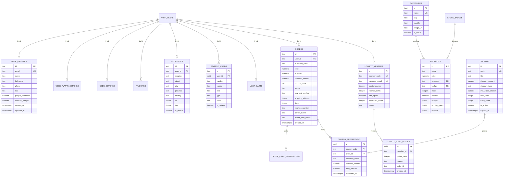

# DIAGRAMA ENTIDAD-RELACIÓN (ERD) — LUMINA HOME
**Versión:** 1.0  
**Motor:** PostgreSQL 15+ / Supabase  

```mermaid
erDiagram
    %% IDENTIDAD Y PERFILES
    AUTH_USERS ||--o| USER_PROFILES : "1 a 1"
    AUTH_USERS ||--o| USER_AVATAR_SETTINGS : "1 a 1"
    AUTH_USERS ||--o| USER_SETTINGS : "1 a 1"
    AUTH_USERS ||--o{ FAVORITES : "1 a N"
    AUTH_USERS ||--o{ ADDRESSES : "1 a N"
    AUTH_USERS ||--o{ PAYMENT_CARDS : "1 a N"
    AUTH_USERS ||--o| USER_CARTS : "1 a 1"
    AUTH_USERS ||--o{ ORDERS : "1 a N"
    AUTH_USERS ||--o| LOYALTY_MEMBERS : "1 a 1"

    USER_PROFILES {
        text id PK
        text email UK
        text name
        text full_name
        text phone
        text role
        boolean google_connected
        boolean account_merged
        timestamptz created_at
        timestamptz updated_at
    }

    %% CATÁLOGO
    CATEGORIES ||--o{ PRODUCTS : "clasifica"
    STORE_BADGES ||--o{ PRODUCTS : "destaca"

    CATEGORIES {
        text id PK
        text name UK
        text slug
        text subtitle
        text image_url
        boolean is_active
    }

    PRODUCTS {
        text id PK
        text name
        numeric price
        text category FK
        text badge FK
        integer stock
        boolean featured
        jsonb images
        jsonb landing_specs
        jsonb combos
    }

    %% OPERACIONES Y COMPRAS
    ORDERS ||--o{ ORDER_EMAIL_NOTIFICATIONS : "audita"
    ORDERS ||--o| COUPON_REDEMPTIONS : "aplica"
    COUPONS ||--o{ COUPON_REDEMPTIONS : "genera"

    ORDERS {
        text id PK
        text user_id FK
        text customer_email
        numeric total
        numeric subtotal
        numeric discount_amount
        text coupon_code
        text status
        text payment_method
        jsonb shipping_address
        jsonb items
        text tracking_number
        text carrier_name
        text wallet_sync_status
        timestamptz created_at
    }

    COUPONS {
        text id PK
        text code UK
        text title
        numeric discount_percent
        text discount_type
        numeric min_order_amount
        integer max_uses
        integer used_count
        boolean is_active
        timestamptz expires_at
    }

    COUPON_REDEMPTIONS {
        uuid id PK
        text coupon_code FK
        text order_id FK
        text customer_email
        numeric discount_amount
        numeric after_amount
        timestamptz redeemed_at
    }

    %% LEALTAD
    LOYALTY_MEMBERS ||--o{ LOYALTY_POINT_LEDGER : "registra"
    LOYALTY_MEMBERS {
        text id PK
        text member_code UK
        text customer_email UK
        integer points_balance
        integer lifetime_points
        numeric total_spent
        integer purchases_count
        text status
    }

    LOYALTY_POINT_LEDGER {
        uuid id PK
        text member_id FK
        integer points_delta
        text reason
        text order_id
        timestamptz created_at
    }

    %% LOGÍSTICA
    ADDRESSES {
        text id PK
        uuid user_id FK
        text recipient
        text street
        text city
        text province
        text country
        double lat
        double lng
        boolean is_default
    }

    PAYMENT_CARDS {
        text id PK
        uuid user_id FK
        text number
        text holder
        text exp
        text type
        text last4
        boolean is_default
    }
```
